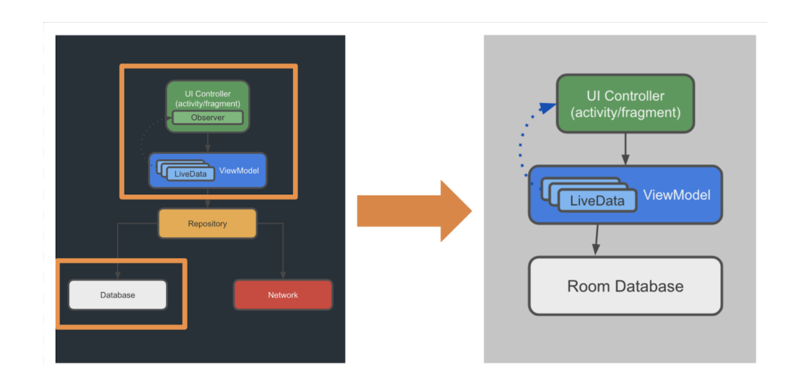

### Objektorientiertes programmieren
#### O-TIN-18

---

### Admin

* Online Unterricht über Zoom
* Kommunikation über Slack
    * Absenzen
    * Aufgaben
    * Fragen
* Anzahl Prüfungen
    * tbd
---

### Kurs Inhalt
* Android Kotlin Fundamentals ([codelabs.developers.google.com/android-kotlin-fundamentals](https://codelabs.developers.google.com/android-kotlin-fundamentals))
* Unit Testing 
* Solid Principles 

---

### Android Kotlin Fundeamentals

* Lesson 1: Build your first app
* Lesson 2: Layouts
* Lesson 3: Navigation
* Lesson 4: Activity and fragment lifecycles
* Lesson 5: Architecture components
* Lesson 6: Room database and coroutines
* Lesson 7: RecyclerView
* Lesson 8: Connecting to the internet
* Lesson 9: Repository
* Lesson 10: Designing for everyone

---

@snap[north]
#### Lesson 1: 
#### Build your first app
@snapend

@snap[west span-40 text-center]

@snapend

@snap[east span-60 text-left]

Lesson 1 includes the following codelabs:

1.0 [Install Android Studio](https://codelabs.developers.google.com/codelabs/kotlin-android-training-install-studio/)
1.1 [Get started](https://codelabs.developers.google.com/codelabs/kotlin-android-training-get-started/)
1.2 [Basic app anatomy](https://codelabs.developers.google.com/codelabs/kotlin-android-training-app-anatomy/)
1.3 [Image resources and compatibility](https://codelabs.developers.google.com/codelabs/kotlin-android-training-images-compat/)
1.4 [Learn to help yourself](https://codelabs.developers.google.com/codelabs/kotlin-android-training-available-resources/)
@snapend

+++

@snap[north]
#### Homework 
@snapend

@snap[west span-50 text-center]

@snapend

@snap[east span-50 text-left]
###### Your first task 
Please try to implement the Airport Finder on your own:

You can find the solution here.
https://gitlab.com/gfelline/airport-finder

@snapend

---

@snap[north]
#### Lesson 2: 
#### Layouts
@snapend

@snap[west span-40 text-center]

@snapend

@snap[east span-60 text-left]

Lesson 2 includes the following codelabs:

[2.1 Linear layout using the Layout Editor](https://codelabs.developers.google.com/codelabs/kotlin-android-training-linear-layout/)
[2.2 Add user interactivity](https://codelabs.developers.google.com/codelabs/kotlin-android-training-interactivity/)
[2.3 Constraint layout using the Layout Editor](https://codelabs.developers.google.com/codelabs/kotlin-android-training-constraint-layout/)
[2.4 Data-binding basics](https://codelabs.developers.google.com/codelabs/kotlin-android-training-data-binding-basics/)

@snapend

+++

###### Solutions 
[2.1 Linear layout using the Layout Editor](https://github.com/ogipogi/2-1-about-me)

[2.2 Add user interactivity](https://github.com/ogipogi/2.2-AboutMe)

[2.3 Constraint layout using the Layout Editor](https://github.com/ogipogi/2.3-ColorMyViews)

[2.4 Data-binding basics](https://github.com/ogipogi/2.4-AboutMe)

+++

###### Different data bindings
https://stackoverflow.com/questions/50226081/android-data-binding-library-vs-kotlin-android-extensions

https://medium.com/databinding-ktx/databindingutil-vs-databinding-ktx-5c0c04a5c483

---

@snap[north]
#### Lesson 3: 
#### Fragments, Navigation
@snapend

@snap[west span-40 text-center]

@snapend

@snap[east span-60 text-left]

Lesson 3 includes the following codelabs:

[3.1 Create a fragment](https://codelabs.developers.google.com/codelabs/kotlin-android-training-create-and-add-fragment/)
* [3.1 Starter App to download](https://github.com/ogipogi/3.1-AndroidTriviaStarter)

[3.2 Define navigation paths](https://codelabs.developers.google.com/codelabs/kotlin-android-training-add-navigation/)
[3.3 Start an external activity](https://codelabs.developers.google.com/codelabs/kotlin-android-training-start-external-activity/)

@snapend

+++

###### Solutions 
[3.1 Create a fragment](https://github.com/ogipogi/3.1-AndroidTrivia)

[3.2 Define navigation paths](https://github.com/ogipogi/3.2-AndroidTrivia)

[3.3 Start an external activity](https://github.com/ogipogi/3.3-AndroidTrivia)

---

@snap[north]
#### Lesson 4: 
#### Lifecycles and logging
@snapend

@snap[west span-40 text-center]

@snapend

@snap[east span-60 text-left]

Lesson 4 includes the following codelabs:

[4.1 Lifecycles and logging](https://codelabs.developers.google.com/codelabs/kotlin-android-training-lifecycles-logging/)
* [4.1 Starter App to download](https://github.com/ogipogi/4.1-DesertClickerStarter)

[4.2 Complex lifecycle situations](https://codelabs.developers.google.com/codelabs/kotlin-android-training-complex-lifecycle/)

@snapend

+++

###### Solutions 

[4.1 Lifecycles and logging](https://github.com/ogipogi/4.1-DesertClicker)

[4.2 Complex lifecycle situations](https://github.com/ogipogi/4.2-DesertClicker)

---

@snap[north]
#### Lesson 5: 
#### ViewModel and ViewModelFactory
@snapend

@snap[west span-40 text-center]

@snapend

@snap[east span-60 text-left]

Lesson 5 includes the following codelabs:

[5.1 ViewModel and ViewModelFactory](https://codelabs.developers.google.com/codelabs/kotlin-android-training-view-model/)
* [5.1 Starter App to download](https://github.com/ogipogi/5.1-GuessTheWordStarter)

[5.2 LiveData and LiveData observers](https://codelabs.developers.google.com/codelabs/kotlin-android-training-live-data/)

[5.3 Data binding with ViewModel and LiveData](https://codelabs.developers.google.com/codelabs/kotlin-android-training-live-data-data-binding/)

[5.4 LiveData transformations](https://codelabs.developers.google.com/codelabs/kotlin-android-training-live-data-transformations)

@snapend

+++

###### Solutions 

[5.1 ViewModel and ViewModelFactory](https://github.com/ogipogi/5.1-GuessTheWord)

[5.2 LiveData and LiveData observers](https://github.com/ogipogi/5.2-GuessTheWord)

[5.3 Data binding with ViewModel and LiveData](https://github.com/ogipogi/5.3-GuessTheWord)

[5.4 LiveData transformations](https://github.com/ogipogi/5.4-GuessTheWord)

+++

###### Backing properties in Kotlin 

https://proandroiddev.com/backing-properties-in-kotlin-cb78dfebfd90

###### Observer Pattern

https://refactoring.guru/design-patterns/observer

---

@snap[north]
#### Lesson 6: 
#### Create a Room database
@snapend

@snap[west span-40 text-center]

@snapend

@snap[east span-60 text-left]

Lesson 6 includes the following codelabs:

[6.1 Create a Room database](https://codelabs.developers.google.com/codelabs/kotlin-android-training-room-database/)
* [6.1 Starter App to download](https://github.com/ogipogi/6.1-TrackMySleepQualityStarter)

[6.2 Coroutines and Room](https://codelabs.developers.google.com/codelabs/kotlin-android-training-coroutines-and-room/)

[6.3 Use LiveData to control button states](https://codelabs.developers.google.com/codelabs/kotlin-android-training-quality-and-states/)

@snapend

+++

###### Solutions 

[6.1 Create a Room database](https://github.com/ogipogi/6.1-TrackMySleepQuality)

[6.2 Coroutines and Room](https://github.com/ogipogi/6.2-TrackMySleepQuality)

[6.3 Use LiveData to control button states](https://github.com/ogipogi/6.3-TrackMySleepQuality)

+++

###### Observer Pattern

https://refactoring.guru/design-patterns/singleton

###### Room Database

https://developer.android.com/training/data-storage/room

